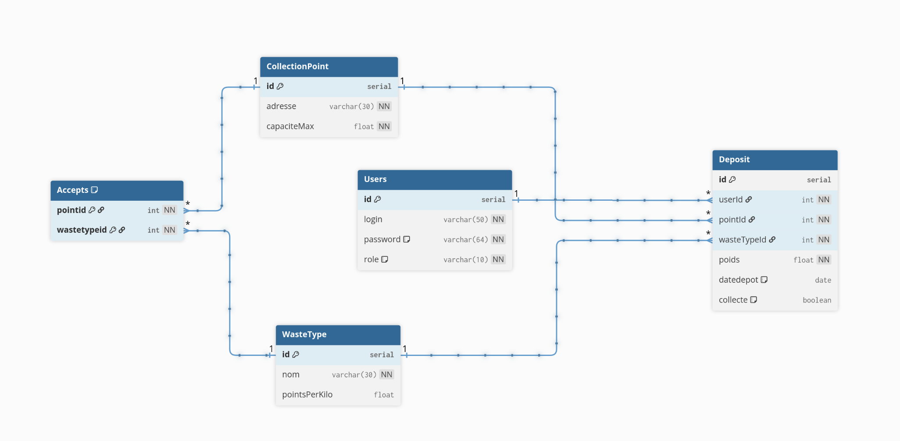

# Ecodrop : Le service de recyclage RESTful

## Sommaire

- [Membres de l'équipe](#membres-de-léquipe)
- [Présentation](#présentation)
- [Installation rapide](#installation-rapide)
- [Liens utiles](#liens-utiles)
- [Schéma de la base](#schéma-de-la-base)
- [Explication des requêtes complexes](#explication-des-requêtes-complexes)
- [Retours de l'API](#retours-de-lapi)
- [Les petits plus](#les-petits-plus)

## Membres de l'équipe

**Groupe G1**

Réalisé par :
- **Paul-Arnaud Delavictoire** : [paul-arnaud.delavictoire.etu@univ-lille.fr](mailto:paul-arnaud.delavictoire.etu@univ-lille.fr)  
- **Baptiste Lavogiez** : [baptiste.lavogiez.etu@univ-lille.fr](mailto:baptiste.lavogiez.etu@univ-lille.fr)  
- ***Enseignant : Mme Everaere / Mr Mathieu***

## Présentation

Ecodrop est le terrain d'apprentissage parfait pour concevoir une API REST sécurisée, résiliente et testable. Ce service de collecte de déchets permet d'obtenir des points de recyclage où sont déposés des déchets par des utilisateurs. Par l'API REST, différents services externes pourront alors obtenir, injecter ou modifier un [ensemble de données](#schéma-de-la-base). 

### Stack tecknique

- Java EE, Tomcat
- PostgreSQL
- Bruno (Tests API, alternative à Postman)
- GitLab CI
- Docker Compose

### Installation rapide

Une [image docker](docker-compose.yml) compacte permet de tester le projet rapidement. Vous n'avez donc **aucune dépendance** à installer, **ni même à compiler**.

En ayant `podman` d'installé (ou `docker`), vous pouvez :

```bash
user@votre-machine$ ./run.sh build # lancer l'application sur port 8080 (base : 5432) 
user@votre-machine$ ./run.sh build test # lancer l'application sur port 8080 (base : 5432) et la tester avec bruno-cli instanément
user@votre-machine$ ./run.sh test # uniquement tester l'application (70 tests unitaires d'API)
```

## Liens utiles

Mme Everaere : 

| Code |
|------|
| [Répertoire principal](tomcat/webapps/ecodrop/WEB-INF/src) |
| [Répertoire de tests](bruno-clean) |
| CI ; tests à la volée -> voir l'historique des commits ([exemple](https://gitlab.univ-lille.fr/baptiste.lavogiez.etu/ecodrop/-/jobs/225791)) |

## Schéma de la base

<!-- > Coller le bloc ci-dessous sur [dbdiagram.io](https://dbdiagram.io) pour obtenir la capture.

```dbml
Table WasteType {
  id            serial      [pk, increment]
  nom           varchar(30) [not null]
  pointsPerKilo float
}

Table CollectionPoint {
  id          serial      [pk, increment]
  adresse     varchar(30) [not null]
  capaciteMax float       [not null]
}

Table Accepts {
  pointid     int [not null]
  wastetypeid int [not null]

  indexes {
    (pointid, wastetypeid) [pk]
  }
}

Table Users {
  id       serial      [pk, increment]
  login    varchar(50) [not null, unique]
  password varchar(64) [not null, note: 'SHA-256']
  role     varchar(10) [not null, note: 'USER | ADMIN']
}

Table Deposit {
  id          serial  [pk, increment]
  userId      int     [not null]
  pointId     int     [not null]
  wasteTypeId int     [not null]
  poids       float   [not null]
  datedepot   date    [default: `now()`]
  collecte    boolean [default: false]
}

// 1,1 - 0,*
Ref: Accepts.pointid     > CollectionPoint.id
Ref: Accepts.wastetypeid > WasteType.id
Ref: Deposit.userId      > Users.id
Ref: Deposit.pointId     > CollectionPoint.id
Ref: Deposit.wasteTypeId > WasteType.id
```

*(insérer capture ici)* -->



- **WasteType** : référentiel des types de déchets, chacun avec un nombre de points accordés par kilo déposé.
- **CollectionPoint** : point de collecte physique identifié par son adresse et sa capacité maximale en kg.
- **Accepts** : table d'association (clé primaire composite) reliant chaque point aux types de déchets qu'il accepte.
- **Users** : utilisateurs de l'API, avec un rôle `USER` ou `ADMIN`. Les mots de passe sont stockés en SHA-256 via `pgcrypto`.
- **Deposit** : enregistrement d'un dépôt ; lie un utilisateur, un point et un type de déchet, avec le poids et la date. Le flag `collecte` passe à `true` une fois le point vidé (`DELETE /points/{id}/clear`), ce qui exclut le dépôt du calcul du taux de remplissage.

Tout fonctionne en `ON UPDATE CASCADE` et `ON DELETE CASCADE`.

## Explication des requêtes complexes

Quatre requêtes SQL non triviales méritent d'être explicitées.

| Endpoint | Requête (simplifiée) | Ce qui la rend complexe |
|---|---|---|
| `GET /users/leaderboard` | `SELECT Users.*, SUM(dp.poids * wt.pointsPerKilo) AS score FROM Users JOIN Deposit dp ON Users.id=dp.userId JOIN WasteType wt ON dp.wasteTypeId=wt.id GROUP BY Users.id ORDER BY score DESC LIMIT ?` | Triple jointure, agrégation produit `poids × pointsPerKilo`, tri décroissant sur score calculé |
| `GET /points/overloaded` | `SELECT cp.* FROM CollectionPoint cp LEFT JOIN Deposit dp ON dp.pointId=cp.id AND dp.collecte IS NOT TRUE GROUP BY cp.id HAVING (COALESCE(SUM(dp.poids), 0) / cp.capaciteMax * 100) > ?` | `LEFT JOIN` avec filtre dans la condition de jointure pour exclure les dépôts collectés, `COALESCE` pour les points sans dépôt, seuil calculé dans `HAVING` |
| `GET /points/{id}/status` | Même logique que `overloaded` mais sur un seul point - retourne le taux de remplissage en % | Calcul dynamique du taux, dépôts collectés exclus via le `LEFT JOIN` conditionnel |
| `GET /deposits` | `SELECT d.*, wt.nom AS nomDechet, cp.adresse AS adressePoint FROM Deposit d JOIN WasteType wt ON wt.id=d.wasteTypeId JOIN CollectionPoint cp ON cp.id=d.pointId` | Vue enrichie : jointures Deposit × WasteType × CollectionPoint pour dénormaliser et éviter N+1 requêtes côté client |

## Retours de l'API

| Endpoint | Headers fournis | Condition | Code |
|---|---|---|---|
| `GET /auth/token` | `Authorization: Basic <base64>` | Identifiants valides -> token JWT | 200 |
| `GET /auth/token` | Pas de header / format invalide | - | 401 |
| `GET /auth/token` | `Authorization: Basic <base64>` | Mauvais identifiants | 404 |
| `GET /points` | - | - | 200 |
| `GET /points/{id}` | - | Point trouvé | 200 |
| `GET /points/{id}` | - | Point inexistant | 404 |
| `GET /points/{id}/status` | - | Point trouvé | 200 |
| `GET /points/{id}/status` | - | Point inexistant | 404 |
| `GET /points/overloaded` | Token admin | Taux > 80% retourné | 200 |
| `GET /points/overloaded` | Token user / absent | - | 401 |
| `PUT /points/{id}` | Token (tout rôle) | Mise à jour réussie | 200 |
| `PUT /points/{id}` | Token absent | - | 401 |
| `PUT /points/{id}` | Token (tout rôle) | Point inexistant | 404 |
| `PATCH /points/{id}` | Token (tout rôle) | Mise à jour partielle réussie | 200 |
| `PATCH /points/{id}` | Token absent | - | 401 |
| `PATCH /points/{id}` | Token (tout rôle) | Point inexistant | 404 |
| `DELETE /points/{id}/clear` | Token admin | Dépôts marqués collectés | 200 |
| `DELETE /points/{id}/clear` | Token user / absent | - | 401 |
| `GET /deposits` | - | Vue enrichie (nom déchet + adresse) | 200 |
| `GET /deposits/{id}` | Token (tout rôle) | Dépôt trouvé | 200 |
| `GET /deposits/{id}` | Token absent | - | 401 |
| `GET /deposits/{id}` | Token (tout rôle) | Dépôt inexistant | 404 |
| `POST /deposits` | Token (tout rôle) | Dépôt créé | 200 |
| `POST /deposits` | Token (tout rôle) | Poids négatif | 400 |
| `POST /deposits` | Token absent | - | 401 |
| `POST /deposits` | Token (tout rôle) | Point plein (taux ≥ 100 %) | 403 |
| `PUT /deposits/{id}` | Token (tout rôle) | Mise à jour réussie | 200 |
| `PUT /deposits/{id}` | Token absent | - | 401 |
| `PUT /deposits/{id}` | Token (tout rôle) | Dépôt inexistant | 404 |
| `PATCH /deposits/{id}` | Token (tout rôle) | Mise à jour partielle réussie | 200 |
| `PATCH /deposits/{id}` | Token absent | - | 401 |
| `PATCH /deposits/{id}` | Token (tout rôle) | Dépôt inexistant | 404 |
| `GET /users` | - | - | 200 |
| `GET /users/leaderboard` | - | Top 10 recycleurs par score (`sum(poids*pointsPerKilo)`) | 200 |
| `PUT /users/{id}` | Token (tout rôle) | Mise à jour réussie | 200 |
| `PUT /users/{id}` | Token absent | - | 401 |
| `PUT /users/{id}` | Token (tout rôle) | Utilisateur inexistant | 404 |
| `PATCH /users/{id}` | Token (tout rôle) | Mise à jour partielle réussie | 200 |
| `PATCH /users/{id}` | Token absent | - | 401 |
| `PATCH /users/{id}` | Token (tout rôle) | Utilisateur inexistant | 404 |
| `GET /waste-types` | - | - | 200 |
| `GET /waste-types/{id}` | - | Type trouvé | 200 |
| `GET /waste-types/{id}` | - | Type inexistant | 404 |
| `POST /waste-types` | Token (tout rôle) | Type créé | 200 |
| `POST /waste-types` | Token absent | - | 401 |
| `POST /waste-types` | Token (tout rôle) | Nom déjà existant | 409 |
| `PUT /waste-types/{id}` | Token (tout rôle) | Mise à jour réussie | 200 |
| `PUT /waste-types/{id}` | Token absent | - | 401 |
| `PUT /waste-types/{id}` | Token (tout rôle) | Type inexistant | 404 |
| `DELETE /waste-types/{id}` | Token admin | Suppression réussie | 200 |
| `DELETE /waste-types/{id}` | Token user / absent | - | 401 |
| `DELETE /waste-types/{id}` | Token admin | Type inexistant | 404 |
| `DELETE /waste-types/{id}` | Token admin | Référencé dans un Deposit | 409 |
| `GET /accepts` | - | - | 200 |
| `POST /accepts` | Token (tout rôle) | Association créée | 200 |
| `POST /accepts` | Token absent | - | 401 |
| `POST /accepts` | Token (tout rôle) | Association déjà existante | 409 |
| `DELETE /accepts/{pointId}/{wasteTypeId}` | Token admin | Suppression réussie | 200 |
| `DELETE /accepts/{pointId}/{wasteTypeId}` | Token user / absent | - | 401 |
| `DELETE /accepts/{pointId}/{wasteTypeId}` | Token admin | Association inexistante | 404 |

## Les petits plus

- Tests `bruno` disponibles avec `Bruno CLI` -> `cd bruno && bru run --env local --tests-only` ;
- Conteneurisation de l'application pour faciliter le développement / tests, notamment vis-à-vis de l'idempotence des tests ;
- CI GitLab de tests automatiques à chaque push : construction de l'image, lancement et test sur runner hébergé sur Dattier (pas de runner privilégié dispo sur le GitLab universitaire). Voir les commits et la petite checkbox à côté pour détails !
- Chiffrement SHA256 des mots de passe avec l'extension `pgcrypto`.